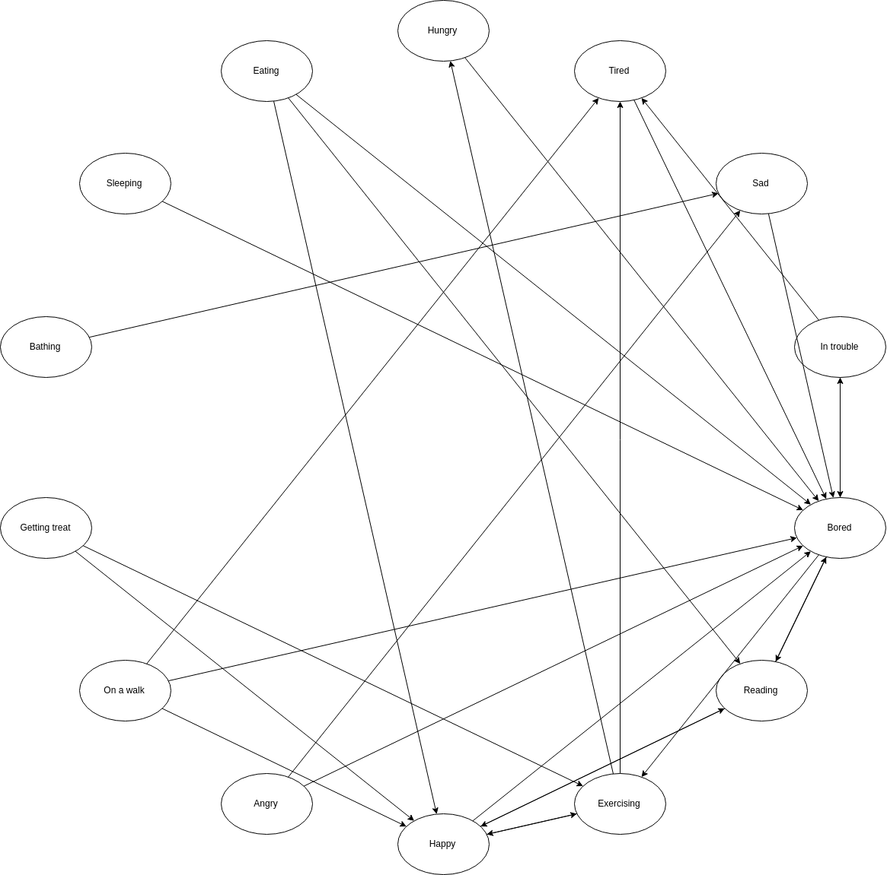

About
=====
Developed for Drexel CS164; adapted from `docs.html`

Introduction
------------

One day, you hear a knock at your door. To your surprise, the person outside is no one other than Spongebob Squarepants, with snail Gary in tow! Spongebob humbly asks if you would be willing to watch Gary for him while he goes on a week-long jellyfishing trip. Of course, you gladly fulfill Spongebob's request. After a couple hours during which he explains to you all of the intricacies of snail care, Spongebob bids his Garebear farewell and hops on the next bus to Jellyfish Fields. It's a shame that you weren't paying attention! Hopefully Gary will tell you what he needs.

Gary's Behavior
---------------

After observing Gary for a few hours, you figure out that his behavior is determined by a finite state machine. You manage to create a list of all his possible states:

**Hungry, tired, sad, in trouble, bored, reading, exercising, happy, angry, on a walk, getting treat, bathing, sleeping, eating**

You can now create a diagram linking these states:

  
  

As a house snail, Gary is used to being left alone sometimes, and so he exhibits a sequence of semirandom behaviors throughout the day. He will try to entertain himself and express physical needs due to hunger and fatigue. When interacted with, this will automatically set his state in response to the stimuli. There are certain states that can only be reached by human interaction, which each lead back into Gary's natural state flow. For instance, you found that he tends to get tired from walks, and baths make him sad! Other times, however, his behavior is less deterministic.

Program Architecture
--------------------

### Adding states and stimuli

All of the possible states that Gary can reach and stimuli that he can respond to are organized in the "states" and "stimuli" global arrays of `virtual-pet.js`. To add a new state, just abide by the following format. New corresponding images should be placed in `assets/pet-pics/`.

    
    {
        name: "happy", // System name of state
        desc: "Gary is feeling happy.", // How it's described to user
        img: "gary-happy.jpeg", // Path to corresponding pic
        next: [ // Possible states reached from this one
            "bored",
            "read",
            "wheel"
        ]
    },
    

To add a new stimulus, follow this format:

    
    {
        name: "pet", // System name
        desc: "Pet", // Action available to user
        effects: [ // List of possible states caused
            "happy",
            "angry"
        ]
    },
    

The program will automatically generate an HTML button for each stimulus.

### The state machine

Gary's behavior changes are a stochastic process. At any given state, Gary will either respond to a user stimulus, or else change his state automatically according to `idleUpdate()`. Gary is granted the opportunity to change state after a sleep time of some number of milliseconds specified by the `TICK` constant. If Gary is left alone, then at every tick, he has a probability to remain in his current state specified by the `STATE_RETAIN` constant. If state retention does not occur, then Gary has an equal chance to transition to any of the other states which may be reached from his current one. If Gary instead receives a stimulus from the user prior to his next update, then his state will be set according to the stimulus, and his idle update timer will be reset. See the code for this state machine in `virtual-pet.js`.

